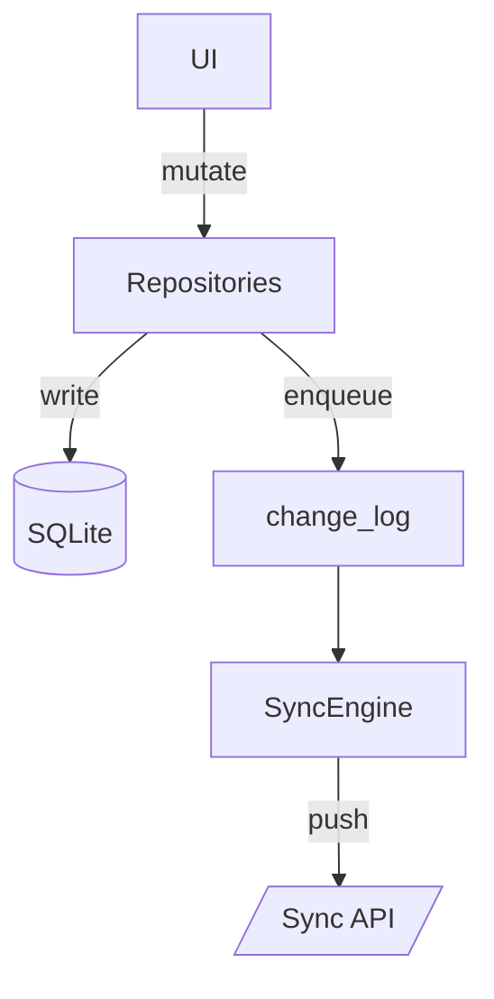
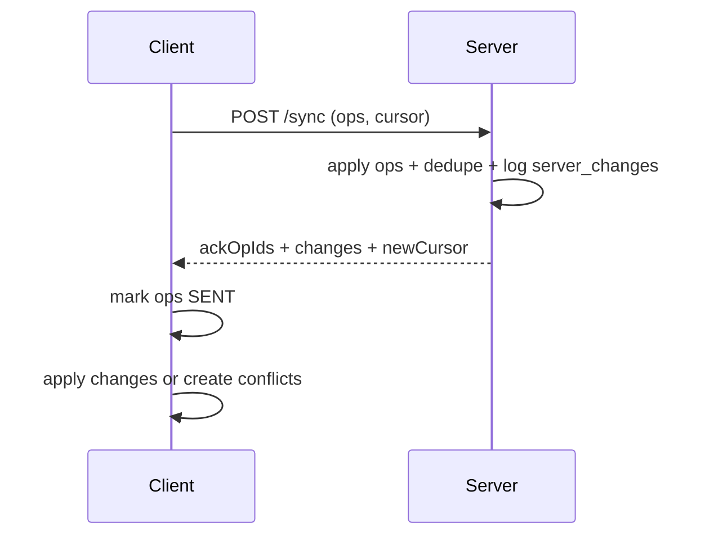
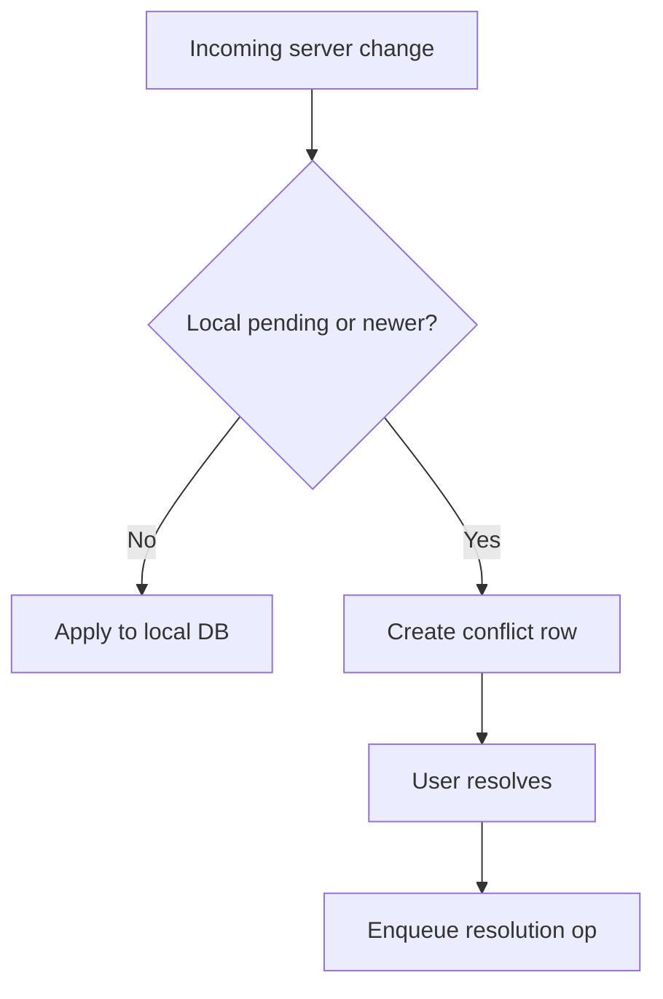

# TaskTrak — Offline-first Jira‑lite

## Overview
TaskTrak is a senior‑level offline‑first task tracker inspired by Jira. It uses a local SQLite database, an append‑only change log, idempotent sync, and conflict resolution UX to handle intermittent connectivity. The app prioritizes local responsiveness while providing reliable sync when network returns.

## Why Offline‑First
Real teams work on the move. TaskTrak treats local data as the source of truth and syncs in the background:
- Fast, responsive UI even without network.
- Durable local writes with encrypted sensitive fields.
- Eventual consistency via change log and delta sync.

## Sync Architecture (high‑level)
1) Local mutations update SQLite and enqueue a change_log op.
2) SyncEngine pushes ops to the server in batches.
3) Server acks opIds (idempotent via op_dedup) and returns delta changes since cursor.
4) Client applies changes or creates conflicts when local edits exist.

## Conflict Resolution Strategy
- If local edits are pending or local is newer than remote, a conflict is recorded.
- Conflict resolution UI supports Keep Local, Use Remote, or Manual Merge.
- Resolution enqueues a new UPSERT op and marks conflict RESOLVED.

## Tech Stack
- React Native (Ignite), Expo
- SQLite (expo-sqlite)
- Secure store (expo-secure-store)
- Fastify + Prisma + Postgres
- JWT access + refresh tokens

## Tradeoffs & Future Work
- No server‑side merge in v1 (last‑write‑wins).
- Background sync is best‑effort, not guaranteed.
- Future: conflict auto‑merge heuristics, project/member sync, and server‑side audit logs.

---

## Architecture Diagrams (Mermaid)

### Local‑first data flow

### Sync push/pull cycle

### Conflict resolution flow

---

## Demo Checklist
- Offline create/edit
- Reconnect + sync
- Conflict creation
- Conflict resolution
- Background sync (best effort)
